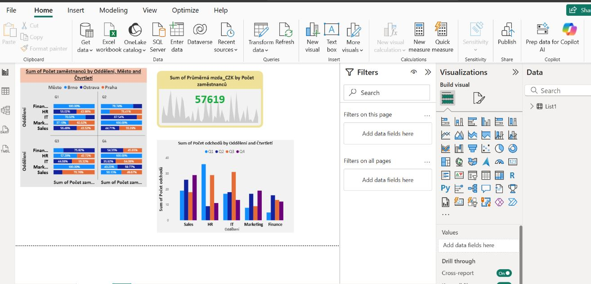
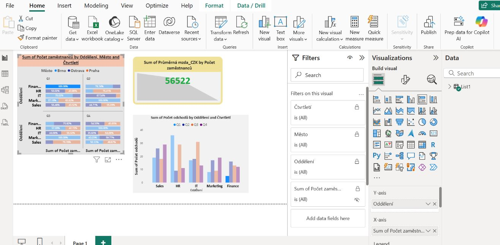
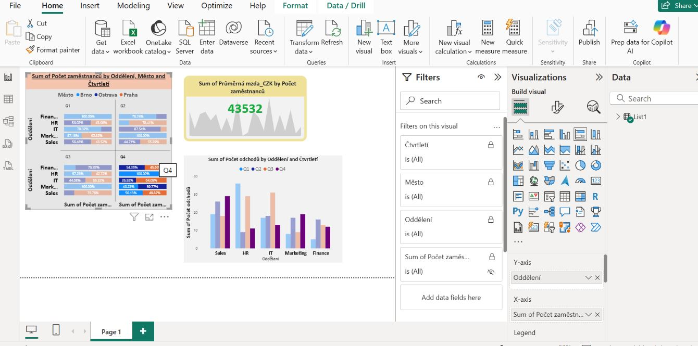
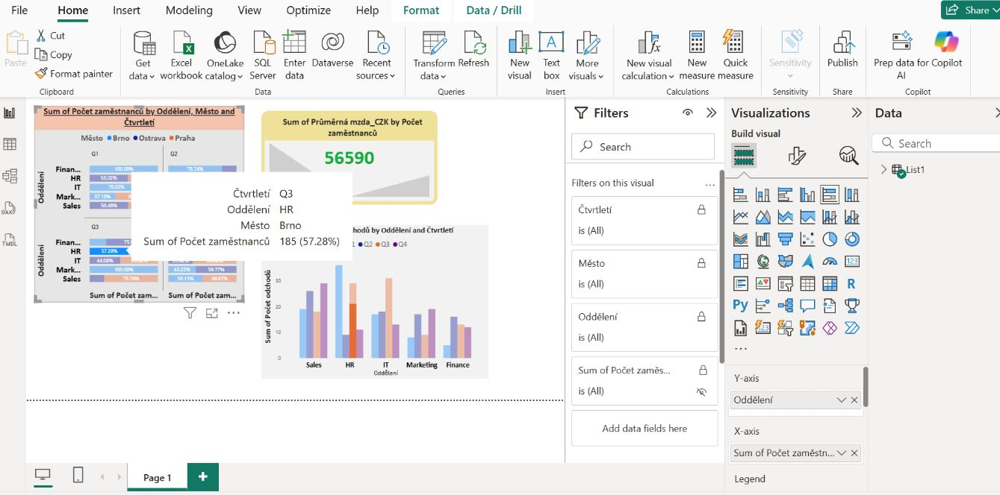
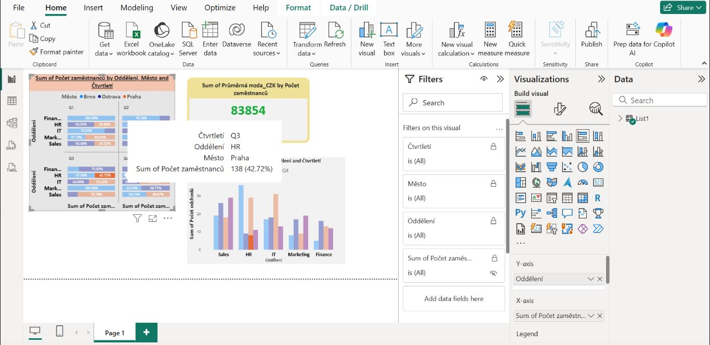

# HR, ESG & Finance Analytics Dashboard (2024)

**EN:**  
This project presents a **Power BI dashboard** built on a fictional dataset `dataset_HR_ESG_Finance_rok2024.xlsx`.  
The purpose is to practice HR and financial data analysis, focusing on key workforce and compensation metrics, with anonymized and synthetic data.  

**CZ:**  
Tento projekt představuje **Power BI dashboard** vytvořený na základě fiktivního datasetu `dataset_HR_ESG_Finance_rok2024.xlsx`.  
Cílem je procvičit si analýzu HR a finančních dat se zaměřením na klíčové metriky zaměstnanců a odměňování, s použitím anonymizovaných a syntetických dat.  

---
## Dataset
- **File:** [`dataset_HR_ESG_Finance_rok2024.xlsx`](dataset_HR_ESG_Finance_rok2024.xlsx)  
- **Content:**  
  - Employee counts per department, city, and quarter  
  - Average salaries (CZK)  
  - Employee attrition / exits  
  - Departmental and quarterly trends  

**CZ:**  
- **Soubor:** [`dataset_HR_ESG_Finance_rok2024.xlsx`](dataset_HR_ESG_Finance_rok2024.xlsx)  
- **Obsah:**  
  - Počty zaměstnanců podle oddělení, města a čtvrtletí  
  - Průměrné mzdy (CZK)  
  - Odchody zaměstnanců (attrition)  
  - Trendy podle oddělení a čtvrtletí  
---

## Key Metrics / Klíčové metriky
- **Headcount** – počet zaměstnanců podle oddělení, lokality a času  
- **Average Salary (CZK)** – průměrná mzda na zaměstnance  
- **Attrition (Employee Exits)** – počty odchodů podle oddělení a čtvrtletí  
- **Departmental Comparison** – porovnání HR, IT, Sales, Marketing a Finance mezi lokalitami Brno, Ostrava, Praha  

---
## Visualizations / Vizualizace

### 1. Employee Headcount by Department, City, and Quarter  
**EN:** Shows workforce distribution across Brno, Ostrava, and Prague, split by departments and quarters.  
**CZ:** Zobrazuje rozložení zaměstnanců v Brně, Ostravě a Praze, rozdělené podle oddělení a čtvrtletí.  

---

### 2. KPI – Average Salary (CZK)  
**EN:** A KPI card displaying the average salary per employee across all departments.  
**CZ:** KPI karta zobrazující průměrnou mzdu na zaměstnance napříč všemi odděleními.  

---

### 3. Attrition by Department and Quarter  
**EN:** Bar chart showing employee exits (attrition) per department and per quarter.  
**CZ:** Sloupcový graf znázorňující odchody zaměstnanců (attrition) podle oddělení a čtvrtletí.  

---

### 4. Drilldown – HR Department (Brno vs. Prague)  
**EN:** Detailed view of HR department workforce split between Brno and Prague in selected quarters.  
**CZ:** Detailní pohled na oddělení HR – rozdělení zaměstnanců mezi Brno a Prahu ve vybraných čtvrtletích.  

---

### 5. Salary Trends and Department Attrition  
**EN:** Combined view of salary development with departmental exits. Useful for HR analytics and workforce planning.  
**CZ:** Kombinovaný pohled na vývoj mezd a odchody zaměstnanců dle oddělení. Užitečné pro HR analytiku a plánování pracovní síly.  

---

## Conclusion / Závěr
**EN:**  
This Power BI project demonstrates practical HR data analysis skills using synthetic data. It highlights how to track employee counts, attrition, and salary trends across locations and departments.  

**CZ:**  
Tento Power BI projekt demonstruje praktické dovednosti HR datové analytiky na syntetických datech. Ukazuje, jak sledovat počty zaměstnanců, odchody a trendy mezd napříč lokalitami a odděleními.  

---
