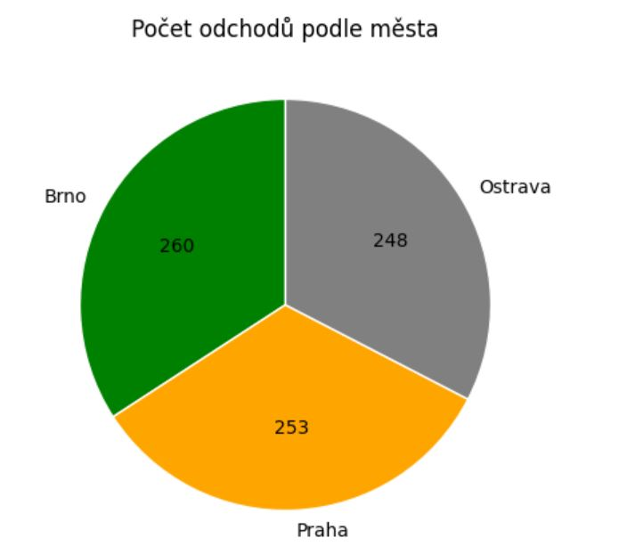

## 📊 HR, ESG & Finance Analytics Dashboard (2024)

Tento projekt pracuje so syntetickými HR & Finance dátami za rok 2024.
Obsahuje analýzu zamestnancov, miezd, odchodov a ďalších metrík.
Dáta sú spracované v **Python (pandas, matplotlib) a vizualizované aj v Power BI**.

## 📂 Dataset

**File:** [`dataset_HR_ESG_Finance_2024.xlsx`](dataset_HR_ESG_Finance_2024.xlsx) 

Obsahuje metriky ako:
Oddělení, Město, Čtvrtletí
Počet zaměstnanců, FTE
Počet nástupů, Počet odchodů
Důvody odchodů
Průměrná mzda (CZK)
Počet sick days, Skóre onboardingu

(Dáta sú syntetické – vytvorené pre účely cvičenia.)

## 🔍 Analytické dotazy v Pythone
## 1️⃣ Počet odchodů podle města


## 2️⃣ Průměrná mzda podle oddělení


## 📊 Cody/Kódy:

**Průměrná mzda podle oddělení** a **Počet odchodů podle města**

```python
avg_salary = (df.groupby("Oddělení", as_index=False)["Průměrná mzda_CZK"]
              .mean()
              .sort_values("Průměrná mzda_CZK", ascending=False))
print(avg_salary)


leaves_by_city = (df.groupby("Město", as_index=False)["Počet odchodů"]
                  .sum()
                  .sort_values("Počet odchodů", ascending=False))
print(leaves_by_city)

___________________

** CZ:**  
- **Soubor:** [`dataset_HR_ESG_Finance_2024.xlsx`](dataset_HR_ESG_Finance_2024.xlsx)  
- **Obsah:**  
  - Počty zaměstnanců podle oddělení, města a čtvrtletí  
  - Průměrné mzdy (CZK)  
  - Odchody zaměstnanců (attrition)  
  - Trendy podle oddělení a čtvrtletí  
---

## Key Metrics / Klíčové metriky
- **Headcount** – počet zaměstnanců podle oddělení, lokality a času  
- **Average Salary (CZK)** – průměrná mzda na zaměstnance  
- **Attrition (Employee Exits)** – počty odchodů podle oddělení a čtvrtletí  
- **Departmental Comparison** – porovnání HR, IT, Sales, Marketing a Finance mezi lokalitami Brno, Ostrava, Praha  

---

## Visualizations / Vizualizace

### 1. Employee Headcount
**EN:** Shows workforce distribution across Brno, Ostrava, and Prague, split by departments and quarters.  
**CZ:** Zobrazuje rozložení zaměstnanců v Brně, Ostravě a Praze, rozdělené podle oddělení a čtvrtletí.  


---
### 🛠 Použité nástroje
## Python (pandas, matplotlib)
## Google Colab
## Power BI (dashboard)

## Conclusion / Závěr
**EN:**  
This Power BI project demonstrates practical HR data analysis skills using synthetic data. It highlights how to track employee counts, attrition, and salary trends across locations and departments.  

**CZ:**  
Tento Power BI projekt demonstruje praktické dovednosti HR datové analytiky na syntetických datech. Ukazuje, jak sledovat počty zaměstnanců, odchody a trendy mezd napříč lokalitami a odděleními. 👉 Tento projekt ukazuje kombináciu HR analytiky a vizualizácií v Pythone a Power BI.

---
